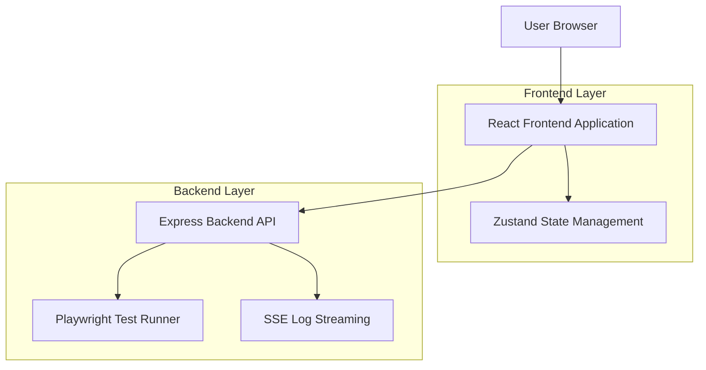
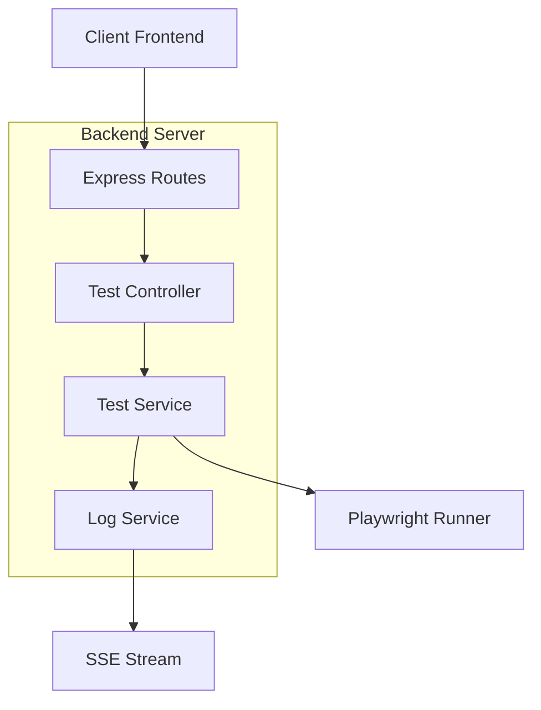
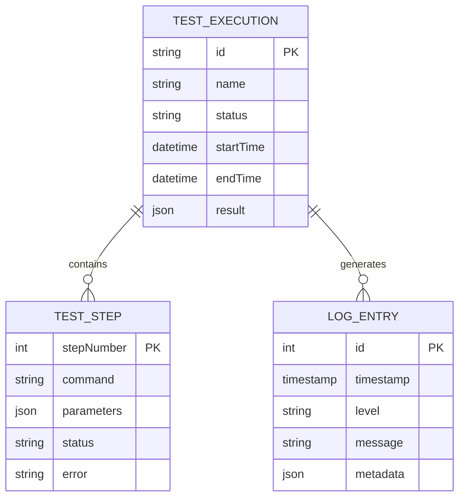

## 1. Architecture design



## 2. Technology Description
- Frontend: React@18 + TypeScript@5 + Tailwind CSS@3 + Vite
- Backend: Node.js@18 + Express@4 + Playwright@1.40
- State Management: Zustand@4.4
- Communication: REST API + Server-Sent Events (SSE)
- Initialization Tool: vite-init

## 3. Route definitions
| Route | Purpose |
|-------|---------|
| / | Home page with test automation interface |
| /api/run-test | Execute test automation via POST request |
| /api/test-status/:id | Get test execution status and logs |
| /api/test-results/:id | Get complete test results |

## 4. API definitions

### 4.1 Core API

**Execute Test**
```
POST /api/run-test
```

Request:
| Param Name| Param Type  | isRequired  | Description |
|-----------|-------------|-------------|-------------|
| testName  | string      | true        | Name of the test |
| steps     | array       | true        | Array of test steps with command and parameters |

Response:
| Param Name| Param Type  | Description |
|-----------|-------------|-------------|
| testId    | string      | Unique identifier for the test execution |
| status    | string      | Initial status: "queued" |

Example Request:
```json
{
  "testName": "Login e formulário",
  "steps": [
    {
      "command": "visit",
      "params": { "url": "https://exemplo.com/login" }
    },
    {
      "command": "type",
      "params": { "selector": "#usuario", "text": "usuario@email.com" }
    }
  ]
}
```

**Get Test Status**
```
GET /api/test-status/:testId
```

Response:
| Param Name| Param Type  | Description |
|-----------|-------------|-------------|
| testId    | string      | Test execution identifier |
| status    | string      | Current status: running/success/failed |
| logs      | array       | Array of log entries |

## 5. Server architecture diagram



## 6. Data model

### 6.1 Data model definition


### 6.2 Data Definition Language

**Test Executions Table (test_executions)**
```sql
-- create table
CREATE TABLE test_executions (
    id UUID PRIMARY KEY DEFAULT gen_random_uuid(),
    name VARCHAR(255) NOT NULL,
    status VARCHAR(20) NOT NULL DEFAULT 'queued' CHECK (status IN ('queued', 'running', 'success', 'failed')),
    start_time TIMESTAMP WITH TIME ZONE,
    end_time TIMESTAMP WITH TIME ZONE,
    result JSONB,
    created_at TIMESTAMP WITH TIME ZONE DEFAULT NOW()
);

-- create index
CREATE INDEX idx_test_executions_status ON test_executions(status);
CREATE INDEX idx_test_executions_created_at ON test_executions(created_at DESC);
```

**Log Entries Table (log_entries)**
```sql
-- create table
CREATE TABLE log_entries (
    id UUID PRIMARY KEY DEFAULT gen_random_uuid(),
    test_execution_id UUID REFERENCES test_executions(id) ON DELETE CASCADE,
    timestamp TIMESTAMP WITH TIME ZONE DEFAULT NOW(),
    level VARCHAR(20) NOT NULL CHECK (level IN ('info', 'success', 'error')),
    message TEXT NOT NULL,
    metadata JSONB,
    created_at TIMESTAMP WITH TIME ZONE DEFAULT NOW()
);

-- create index
CREATE INDEX idx_log_entries_test_execution_id ON log_entries(test_execution_id);
CREATE INDEX idx_log_entries_timestamp ON log_entries(timestamp);
```